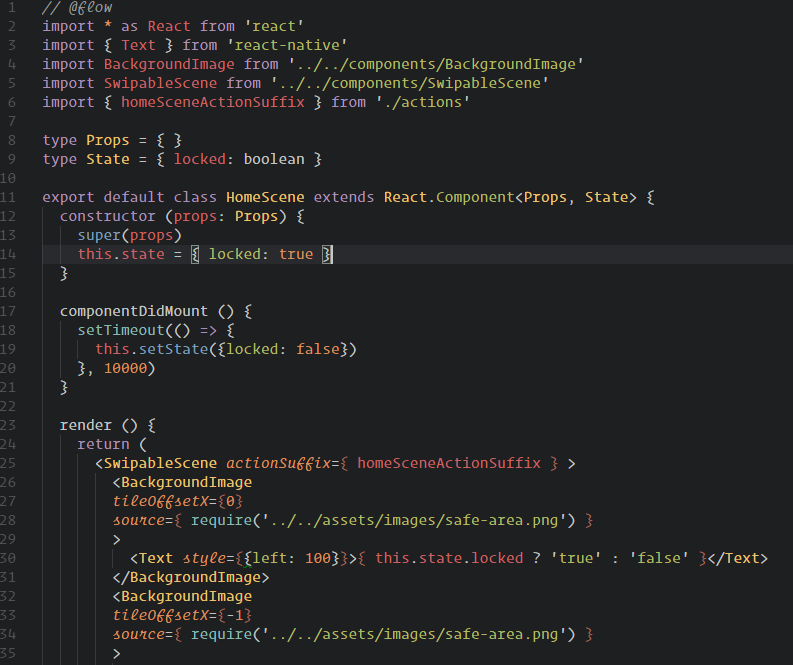

# Base16 Tomorrow Dark
A VSCode theme styled to look like Atom's [base16-tomorrow-dark-theme](https://github.com/atom/base16-tomorrow-dark-theme), with some minor modifications and italics thrown in for flair. Workbench colors taken from Atom's One Dark UI theme.

## Todo
- Theme workbench (WIP, partially done)
- Make markdown prettier

If there's anything else that doesn't look quite right, please open an issue!
